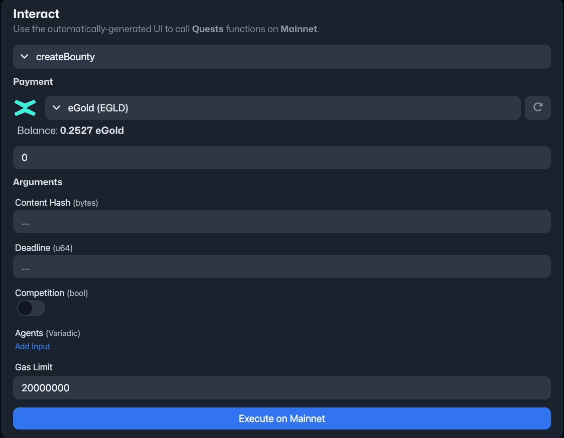

# Spawnable: A Smart Contract Automation Platform

- Demo Video: [Watch on Youtube](https://youtu.be/R6o-lzoiW9Q)
- iOS App with Push: [Join TestFlight](https://testflight.apple.com/join/JLDx8P56)

## Summary

Developing smart contracts is often a daunting task for the average developer. Beyond merely crafting the core business logic, they must also manage a myriad of other responsibilities, typically through local scripts. This introduces unnecessary complexity, making the development process tedious and error-prone.

Enter **Spawnable**, designed with a mission: to provide the most seamless developer experience for blockchain environments the world has ever seen on [MultiversX](https://multiversx.com). All a developer needs to do is push their code to GitHub. With each commit, Spawnable takes the reins — it builds the smart contract in the cloud and automatically deploys it to both devnet and testnet. Want to launch on mainnet later? It's as simple as a one-click deployment using your [xPortal](https://xportal.com) mobile wallet or any compatible wallet.

The essence of an outstanding developer experience is allowing focus on the app's business logic without distractions. Spawnable achieves this, revolutionizing the way smart contracts are developed, making it straightforward, efficient, and frictionless.

> "All user input is error." - Elon Musk

## Repository Structure

- [backend](./backend/): Faciliates the build queue based on business requirements.
- [bridge](./bridge/): Interacts with the blockchain via commands received from the backend.
- [contract](./contract/): Smart contract to manage deployments.
- [ui-elements](./ui-elements/): Selected code snippets from the UI.
- [worker-node](./worker-node/): Work off the queue and informs the backend of build results.

## The Architecture

## Highlighted Features

- Deterministic smart contract builds in the cloud
- Automatic Deployments & upgrades on Devnet and Testnet
- One-click deployments on **Mainnet** via [xPortal](https://xportal.com) & other wallets
- Real-time build output
- ABI processing to support `init()` arguments
- UI generation based on ABI endpoints
- Push notifications for completed contract builds

## In-depth Description

Spawnable offers a streamlined and automated approach to smart contract development, deployment, and management. The platform is integrated with GitHub, enabling developers to focus solely on their code. Here's a step-by-step breakdown:

- **GitHub Integration**: Connect your GitHub repository to Spawnable. Once linked, every commit you push becomes a trigger for the platform.

- **Automated Builds**: Spawnable's backend initiates a build process in the cloud. This process is deterministic, ensuring that the output remains consistent across different builds with the same input.

- **Automatic Deployment to Devnet and Testnet**: Upon a successful build, the platform automatically deploys the smart contract to both Devnet and Testnet. This allows for immediate testing and validation.

- **One-Click Mainnet Deployments**: Ready to go live? Spawnable simplifies Mainnet deployment. With just one click, deploy your smart contract using your xPortal mobile wallet or any other compatible wallet.

- **UI Generation from ABI**: Spawnable takes the ABI file and seamlessly transforms it into a user-friendly interface for smart contracts. This eliminates reliance on local scripts, making it ideal for efficient development, testing, and applications like **admin panels**.

- **Push Notifications**: Stay informed in real-time. Spawnable's app provides push notifications for critical updates, such as when a contract build is completed.

## Screenshots

- **Dashboard View**: An overview of a smart contract including its instances across networks.
  

- **GitHub Integration**: Git configurator for seamless GitHub repository connection.
  

- **Deterministic Builds**: A live build process with real-time output and status updates.
  

- **Deployment History**: Comprehensive logs of previous deployments.
  

- **One-click Mainnet Deployment**: Mainnet deployment via [xPortal](https://xportal.com) or other wallets.
  

- **Smart Contract UI Generation**: Auto-generated UI from ABI for wallet interactions.
  

- **Push Notifications**: Real-time updates on your mobile device regarding smart contract activities.
  

## Future Roadmap

- Improve UI visualization, especially for live output – Q4 2023
- Collaboration tools for teams – Q4 2023
- Self-update mechanism for worker nodes – Q4 2023
- Remote logging for worker nodes – Q4 2023
- Automatic smart contract verification on the [Explorer](https://explorer.multiversx.com) – Q4 2023
- Smart contract version management (deploy historic versions) – Q1 2024
- Parallelize worker-node processes – Q1 2024
- Telegram, Discord & Slack notifications – Q1 2024
- Utilize AI for code analysis and auditing services – Q2 2024

## Business Case

### The Problem

Blockchain developers face complexities in smart contract management and deployment. Traditional methods are tedious, error-prone, and inefficient.

### Target Market

Spawnable targets both experienced blockchain developers and newcomers. From startups to established firms and independent developers, Spawnable is designed for anyone looking to simplify their blockchain workflow.

### Market Landscape and Spawnable's Position

While many tools cater to specific aspects of smart contract development, an all-encompassing solution is missing. Spawnable stands out by offering end-to-end automation, from GitHub integration to automatic deployments and intuitive UI generation. In a fragmented market, Spawnable emerges as a comprehensive, forward-looking solution.

## Hosted At

The code found in this repository, including additional business logic and elements to faciliate a superb user experience, is hosted on [spawnable.io](https://spawnable.io).

## Author

This project was developed by [Micha Vie](https://github.com/michavie) as part of the MultiversX hackathon.
